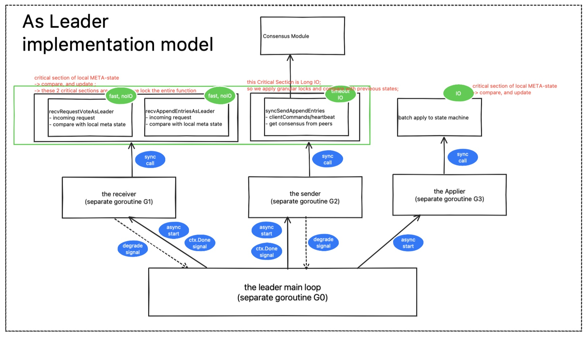

This is a Work-In-Progress Project.
It has a lot of work, and I'm happy to receive "donations" in the form of a :star:.

## Table of Contents

- [Table of Contents](#table-of-contents)
- [What this Project is About](#what-this-project-is-about)
- [What I am currently Doing](#what-i-am-currently-doing)
- [Implementation Models](#implementation-models)
  - [the General Arch](#the-general-arch)
  - [the Meta-State Machine](#the-meta-state-machine)
  - [Peek Inside the Leader](#peek-inside-the-leader)
  - [the 2 types of Goroutine Management](#the-2-types-of-goroutine-management)
- [Extreme Engineering](#extreme-engineering)
- [Educational](#educational)
  - [The Cliche of Distributed Systems](#the-cliche-of-distributed-systems)
  - [Finding Concurrency Patterns](#finding-concurrency-patterns)

## What this Project is About

A Raft implementation to be with a Domain-specific Database:
- to pivot my career to system engineering;
- to be built frirst Toy then Industry level;
- to systematically explores and presents what the **GAPs Paper/Theoretical Modeling and Implementation Modeling/Coding(toy/industry)**;
- to investigate the **TESTING** for a complicated system project; the torturing moments are all about the testing yet I still feel unconfident;
- to find some new **INNOVATION** possiblity for this old protocol;
- **EDUCATION** purpose to help navigate colledge students from small labs to real project; and also show what college students can do;

## What I am currently Doing

**Testing, debugging, refactoring** for the following version:
<b> v0.2.0-alpha </b>
- $5.2 Leader Election
- $5.3 Log Replication
- $5.4 Safety

For detailed information on testing, see [docs/testing.md](docs/testing.md). Your feedback on the designs and specific issues described there is highly appreciated.

## Implementation Models

### the General Arch

### the Meta-State Machine

### Peek Inside the Leader

### the 2 types of Goroutine Management

## Extreme Engineering

MKraft follows the spirit of extreme engineering after reading TigerBeetle's tech documents. And the experience of exploration with Golang and in this MKraft project is under-summarization.

--- links (to be added) ---

## Educational

This part is more educational purpose.

### The Cliche of Distributed Systems

How are these famous requirements and concepts handled in this project?
- Scalability of Reads, Writes
- Fault-tolerance
  - Redundancy (e.g., data replication).
  - Consensus algorithms (like Raft, Paxos) to handle leader failure or network partitions.
  - Retry and backoff strategies.
- Consistency: linearizability
- Availability
handled in this system?

--- links (to be added) ---

### Finding Concurrency Patterns

What patterns of concurrency programming is used ?
I am building a gogymnastics summarizing the patterns used here and going to write a book about it.
--- links (to be added) ---