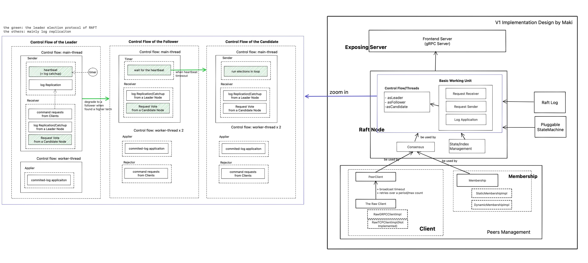

<!--  -->

## What this Project is About
This project is a Raft implementation that aims for an almost-industry-level standard while also serving educational purposes by demonstrating how to implement a system paper.

- "Industry-level": This refers to its focus on clean, maintainable code, performance-oriented designs, and sophisticated testing for rigorous proof. (The term "extreme engineering" is indeed subjective and can be omitted for clarity, as your points already define "industry-level" well).
- "Almost": This qualification is due to the fact that the implementation has not yet been deployed or proven in a real-world industry setting.
- "Educational": Its educational purpose is fulfilled by mapping the implementation directly to the paper's design, while also highlighting the gaps and trade-offs between the theoretical model and practical implementation decisions. 

## Versions

<b> v0.2.0-alpha </b>
- $5.2 Leader Election
- $5.3 Log Replication
- $5.4 Safety

## The Architecture

## System Deisgns
### Invariants/Properties to hold in any condition

1. Election Safety:
at most one leader can be elected at a given term; ($5.2)

2. Leader Append-only: ($5.3)
    - a leader never deletes OR overwrites its log entries;
    - it only appends new log entries;

3. Log Matching: ($5.3)
if two logs contain an entry with the same index + same term, 
all logs are identical in all entries through the given index;

4. Leader Completeness: ($5.4)
IF a log entry is commited in a given term,
then that entry will be present in the logs of the LEADERS for all higher-numbered terms;
(The leader has all pre-committed logs. The log entries only flow from leader to followers.)

5. State Machine Safety: ($5.4)
if a server has applied a log entry at a given index to the state machine, 
no other server will ever apply a different log entry for the same index; 

### Key Mechanisms to maintain the invariants/properties

(1) Voting Restriction ($5.4)
The voter denies its vote if its log is more up-to-date than that of the candidate.
What is more up-to-date mean:
- compare the index(length) and term of the last log entry
- first, the larger term is more updated
- second, if the last terms are the same, the longer log/larger index is the more up-to-date

## The Testing 

### Design Invariants/Properties Verification

#### (1) Election Safety 
In each term change, each node stores a tuple of (timestamp, term, nodeID, the State of Leader/Candidate/Follower),
and we continuously compare logs of all nodes to check if only one leader is elected;

#### (2) Leader append-only (UT-ok)
By condition checking in method and unit-testing, which means the method to overwrite/delete logs cannot be called
by a node which is a leader;

#### (3) Log Matching
We compare the tuples of (index, term and log) of all nodes to check if this is matched.

#### (4) Leader Completeness (UT-ok)
This one is a bit hard to verify directly, but this property is guaranteed by Log Matching and Vote Restriction,
so we check this property by checking the 2 property/restriction indirectly.
For the voting restriction, we validate it by unit-testing to guarantee the vote cannot be true if the restriction is broken.
(marked with invariant)

#### (5) StateMachine Safety
We implement an statemachine which will just record ths raft log with index and term for each node.
The use case is after a testing round is done, we run comparing
the raft logs to check if at any index a different log is applied for the state machine.

### Adversal Environment
- happy env, no injected errors

### Engineering, the testing framework/infra
todo

## Resilience of Engineerings 

1) How the errors are managed?
