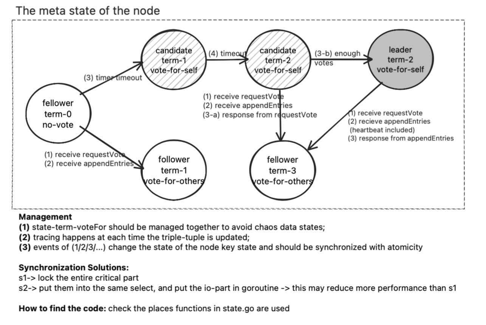
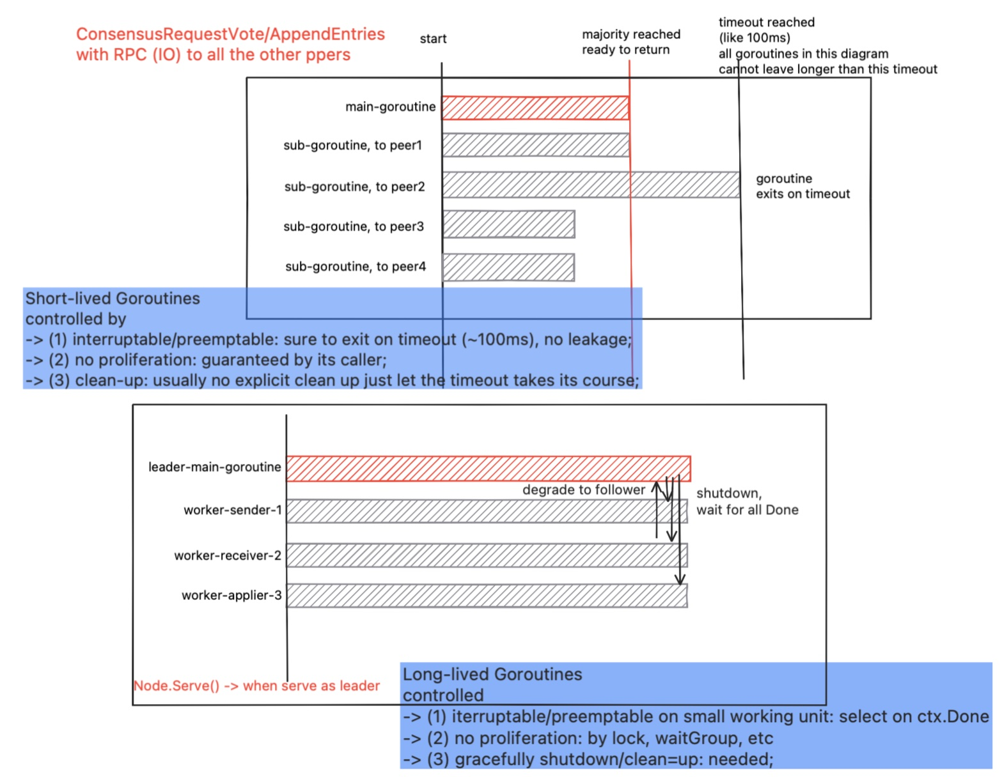

This is a Work-In-Progress Project.
It has a lot of work, and I'm happy to receive "donations" in the form of a :star:.

## Table of Contents

- [Table of Contents](#table-of-contents)
- [What this Project is About](#what-this-project-is-about)
- [Agenda](#agenda)
  - [Currently Doing](#currently-doing)
  - [Backlog](#backlog)
- [Implementation Models](#implementation-models)
  - [the Key Component](#the-key-component)
  - [the Meta-State Machine](#the-meta-state-machine)
  - [the 2 types of Goroutine Management](#the-2-types-of-goroutine-management)
- [Extreme Engineering](#extreme-engineering)
- [Educational](#educational)
  - [The Cliche of Distributed Systems](#the-cliche-of-distributed-systems)
  - [Finding Concurrency Patterns](#finding-concurrency-patterns)

## What this Project is About

Some learning targets while doing
- system engineering
- extreme engineering
- distributed systems: design, develop/reconstructure, testing

Add some nolvelty
- what if the storage is a "domain"-specic db tuned for the "PA" system?
- practice with the traditional k-v first;

<!--  -->

## Agenda

### Currently Doing

Refactoring the Leader with a pipeline pattern for clear code structure and better maintenance.

<b> v0.2.0-alpha </b>
- $5.2 Leader Election (have tested)
- $5.3 Log Replication (refactoring)
- $5.4 Safety (go together with 5.3)

For detailed information on testing, see [docs/testing.md](docs/testing.md). Your feedback on the designs and specific issues described there is highly appreciated.

### Backlog

(1) finish the "Apply" part
 - summarize the 2 types storage v.s. raft log;
 - add a tiny testing purpose statemachine (kv?)

(2) Testing: testing all basic features of the raft kv db
- for correctness only
- for performance

(3) redesign the persister (raft logs) to (refer to tigerbeetle's impl)
- ringbuffers on the disk with 2 pointers
- redesign the log structure
  - the persister is also on batch with checksum?
  - 2 ringbuffers one for headers one for payload?

(4) add log compaction

(5) Testing: testing all basic features of the raft kv db
- for correctness only
- for performance
- fuzzy testing

(6) advanced features

## Implementation Models

### the Key Component

 -->

### the Meta-State Machine

### the 2 types of Goroutine Management

## Extreme Engineering

MKraft follows the spirit of extreme engineering after reading TigerBeetle's tech documents. And the experience of exploration with Golang and in this MKraft project is under-summarization.

--- links (to be added) ---

## Educational

This part is more educational purpose.

### The Cliche of Distributed Systems

How are these famous requirements and concepts handled in this project?
- Scalability of Reads, Writes
- Fault-tolerance
  - Redundancy (e.g., data replication).
  - Consensus algorithms (like Raft, Paxos) to handle leader failure or network partitions.
  - Retry and backoff strategies.
- Consistency: linearizability
- Availability
handled in this system?

--- links (to be added) ---

### Finding Concurrency Patterns

What patterns of concurrency programming is used ?
I am building a gogymnastics summarizing the patterns used here and going to write a book about it.
--- links (to be added) ---